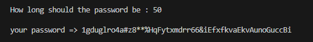
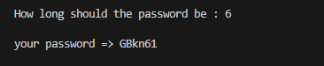

# Simple Password in Python
------------------------------
A simple password generator with the ability to create passwords based on user input or customizable for personal Goochic projects. This program is executed in Python and is made up of three files for further customization. To get started, run the file "run.py".

You can change password patterns by modifying the "password.py" file

#### Create a password with 50 characters.

#### Create a password with 6 characters.

-----------------------------
### The license for this project is for
This is a password-generator project, used in Quera's Git course.
All Rights Reserved @ Quera
